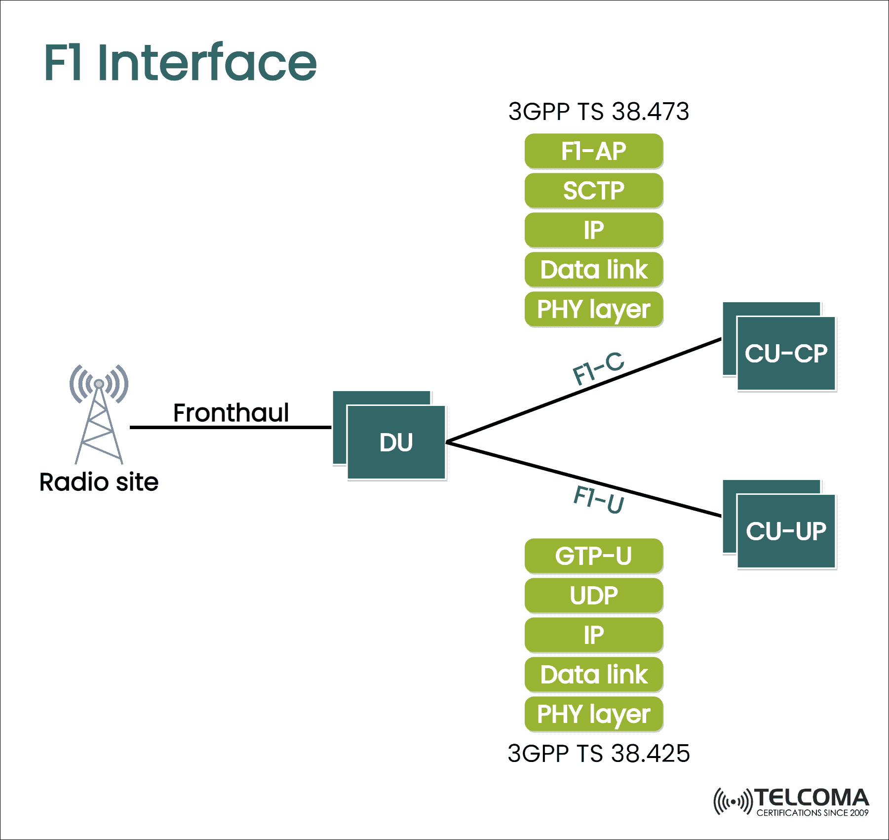

# F1-Control Plane 3GPP 

## Scope

The scope of this repo its to implement the F1-C Interface communication based on [3GPP TS 38.473](https://www.etsi.org/deliver/etsi_ts/138400_138499/138473/15.08.00_60/ts_138473v150800p.pdf) standard.

The functions of F1 Application Protocol (F1-AP) are described in [3GPP TS 38.470](https://www.etsi.org/deliver/etsi_ts/138400_138499/138470/16.02.00_60/ts_138470v160200p.pdf)




- [F1-Control Plane 3GPP](#f1-control-plane-3gpp)
  - [Scope](#scope)
  - [Features](#features)
  - [Client side](#client-side)
  - [Server side](#server-side)
  - [`tcpdump` package flow](#tcpdump-package-flow)


## Features
- SCTP-based communication
- F1SetupRequest and F1SetupResponse handling
- Flexible deployment with Docker

## Client side
```bash
$ go run cmd/cu/main.go -server=192.168.1.20:38473
2025/01/07 09:04:12 Connected to server: 192.168.1.20:38473
2025/01/07 09:04:12 Received from server: Acknowledged
```

## Server side
```bash
$ go run cmd/du/main.go
SCTP server listening on port :38473
Received: Hello from CU!
2025/01/07 09:08:14 Connection closed by client
```

## `tcpdump` package flow

```bash
$ sudo tcpdump -i eth0 port 38473 -A
tcpdump: verbose output suppressed, use -v[v]... for full protocol decode
listening on eth0, link-type EN10MB (Ethernet), snapshot length 262144 bytes
09:04:12.944238 IP 192.168.1.22.40515 > 192.168.1.20.38473: sctp (1) [INIT] [init tag: 293108771] [rwnd: 106496] [OS: 65535] [MIS: 65535] [init TSN: 3299268950]
E..T..@.@............C.I.....?.....4.x|#...........V............
X..................
09:04:12.946488 IP 192.168.1.20.38473 > 192.168.1.22.40515: sctp (1) [INIT ACK] [init tag: 3798204170] [rwnd: 106496] [OS: 65535] [MIS: 65535] [init TSN: 2584174578]
E..D..@.@............I.C.x|#{%m....$.c.
.........._...... B<..b..i...jKP....................
.c.#|x.........n.:.tZ......._.....C........................I..........$:/<Z.OP.Rd.).,.Z....k....$.@s.e............................................4.x|#...........V............
X......................................................
09:04:12.947028 IP 192.168.1.22.40515 > 192.168.1.20.38473: sctp (1) [COOKIE ECHO]
E..(..@.@............C.I.c.
$l.G
.... B<..b..i...jKP....................
.c.#|x.........n.:.tZ......._.....C........................I..........$:/<Z.OP.Rd.).,.Z....k....$.@s.e............................................4.x|#...........V............
X..............................................
09:04:12.948514 IP 192.168.1.20.38473 > 192.168.1.22.40515: sctp (1) [COOKIE ACK]
E..$..@.@............I.C.x|#.'................
09:04:12.948717 IP 192.168.1.22.40515 > 192.168.1.20.38473: sctp (1) [DATA] (B)(E) [TSN: 3299268950] [SID: 0] [SSEQ 0] [PPID 0x0]
E..@..@.@............C.I.c.
...........V........Hello from CU!..
09:04:12.948921 IP 192.168.1.20.38473 > 192.168.1.22.40515: sctp (1) [SACK] [cum ack 3299268950] [a_rwnd 106482] [#gap acks 0] [#dup tsns 0]
E..0..@.@............I.C.x|#dO6P.......V........
09:04:12.948944 IP 192.168.1.20.38473 > 192.168.1.22.40515: sctp (1) [DATA] (B)(E) [TSN: 2584174578] [SID: 0] [SSEQ 0] [PPID 0x0]
E..<..@.@............I.C.x|#...$......_.........Acknowledged
09:04:12.948955 IP 192.168.1.22.40515 > 192.168.1.20.38473: sctp (1) [SACK] [cum ack 2584174578] [a_rwnd 106484] [#gap acks 0] [#dup tsns 0]
E..0..@.@............C.I.c.
.fo......._.........
09:04:12.948989 IP 192.168.1.22.40515 > 192.168.1.20.38473: sctp (1) [SHUTDOWN]
E..(..@.@............C.I.c.
..`......._.
09:04:12.949132 IP 192.168.1.20.38473 > 192.168.1.22.40515: sctp (1) [SHUTDOWN ACK]
E..$..@.@............I.C.x|#..................
09:04:12.949154 IP 192.168.1.22.40515 > 192.168.1.20.38473: sctp (1) [SHUTDOWN COMPLETE]
E..$..@.@............C.I.c.
...>....
```